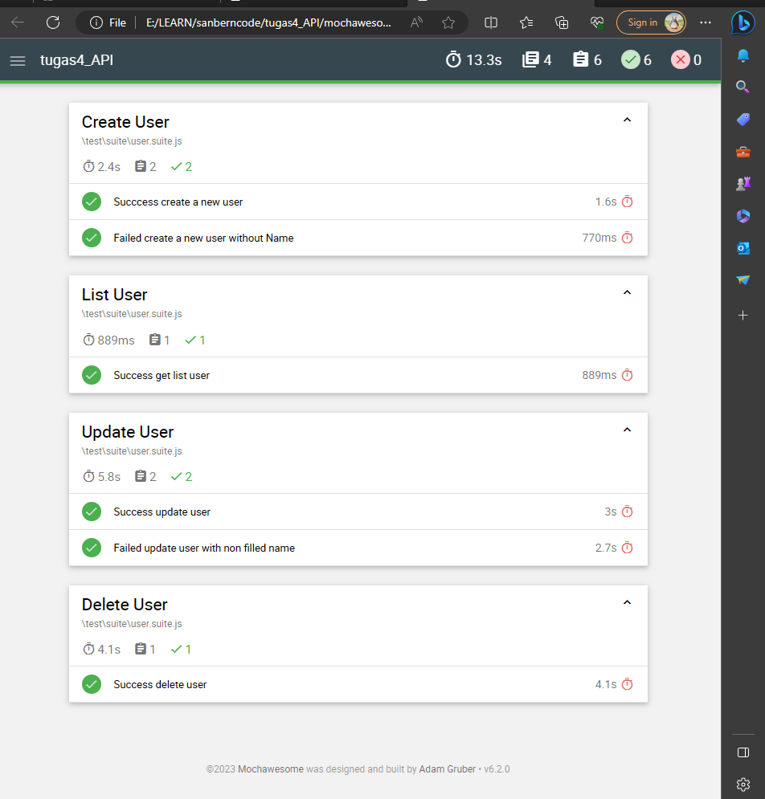

# TUGAS 4 API AUTOMATION 
This Repository used for 4th learning API Automation from Sanberncode

## Dependencies
- mocha
- chai
- supertest
- mochawesome

## Registration
Fill the data on data/registration.json
```
{
    "name": "Toko Testing",
    "email": "testing@mail.com",
    "password": "123" 
}
```
To run this program you can use the following command:
```
    npm run test:regist
```
## Login
Fill the data on data/user.data.json
```
{
    "email": "testing@mail.com",
    "password": "123"      
}
```
To run this program you can use the following command:
```
    npm run test:login
```
## Create, Get, Update, Delete USER 
To run this program you can use the following command:
```
    npm run test:user
```
## Create, Get, Update, Delete UNIT 
To run this program you can use the following command:
```
    npm run test:unit
```
## Show Reporting with MOCHAWESOME
To run this program you can use the following command:
```
    npm run html-report:api
```
### Documentations
For reporting with mochawesome 


For recording run automation
[Video Running](https://drive.google.com/file/d/1fdLe8vtgCZJ9H4jJ4nffpgzvs2Ldq2TW/view?usp=sharing)
